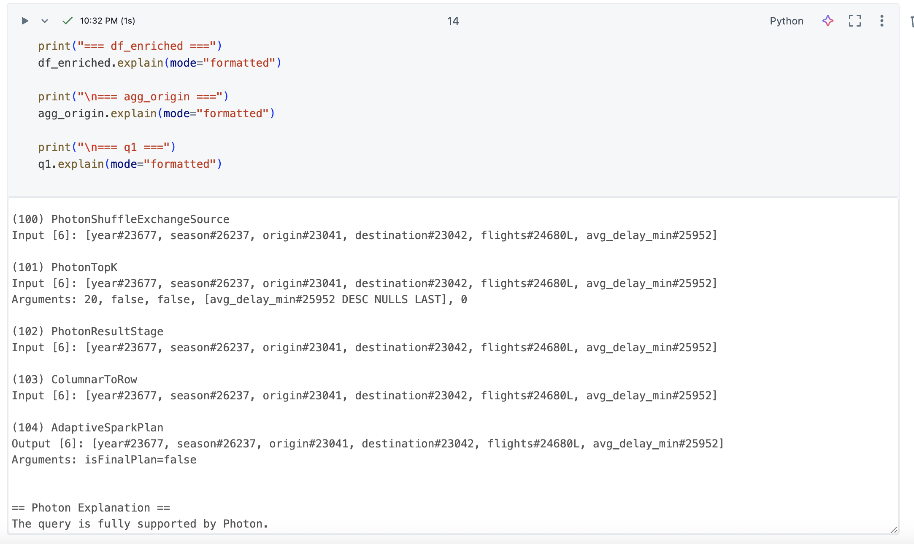
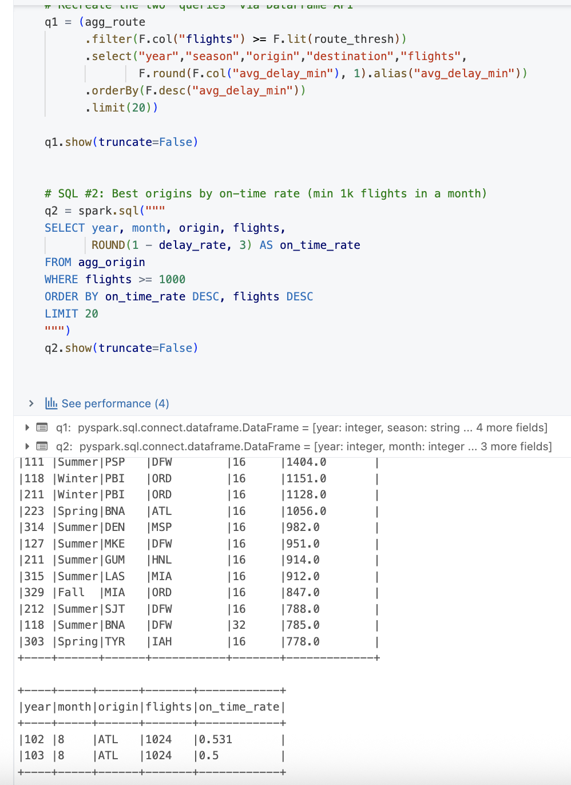

# Data-Engineering-Assignment-11
Duke IDS706 Course Assignment 11


## PySpark Pipeline — Flight Delays (≈2 GB)
### Overview

This project demonstrates a scalable PySpark data pipeline on Databricks that processes ~2 GB of flight delay data, showcases lazy transformations vs. eager actions, and documents performance optimizations (filter pushdown, broadcast join, partition pruning, and shuffle tuning). The dataset begins with the built-in departuredelays.csv and is expanded by repeated unions to exceed 1 GB.

### Dataset

### Source: 
dbfs:/databricks-datasets/flights/departuredelays.csv (Databricks sample)

### Schema:

date:int (yyyymmdd), delay:int (minutes), distance:int (miles), origin:string, destination:string

Scale-up: The base (~0.12 GB) is unioned 16× to reach ~1.92 GB.

Note on environment: Workspace has Public DBFS disabled and (in some runs) no Unity Catalog main. The pipeline supports both Unity Catalog Volumes (if available) and managed tables in the current catalog (e.g., hive_metastore).

### Environment

Platform: Databricks (Spark Connect enabled). Use the provided spark session (do not set .master("local[*]")).

### Serverless notes:

Local file paths like file:/local_disk0/... are blocked.

Use Unity Catalog Volumes (/Volumes/<catalog>/<schema>/<volume>/...) if your catalog exists, or write managed tables via saveAsTable in your current catalog/schema.

.cache() may not be supported on Serverless SQL. The pipeline includes a no-cache alternative for repeated actions.

Pipeline (what each notebook cell does)

1. Setup & Tuning 
```
Set Spark options:
spark.sql.files.maxPartitionBytes=128m (more parallel splits)
spark.sql.shuffle.partitions=200 (tune to cluster size)
```
2. Load & Scale
```
Read the CSV, then unionByName it 4 times (total 16×) to reach ~2 GB; print shape.
```
3. Transformations (withColumn)
```
Clean and parse date → flight_date (using try_to_date with left-pad and digit cleanup).
Derive year, month, day.
is_delayed = delay > 0.
```

4. Early Filters (≥2)
```
Keep only valid rows: flight_date IS NOT NULL, distance > 0, origin/destination NOT NULL.
```

5. Join (Broadcast)
```
Create a tiny month→season dimension (12 rows) and broadcast it:
df_enriched = df_f.join(broadcast(dim_month), "month", "left").
```
6. Aggregations (groupBy)
```
agg_origin (year, month, origin) → flights, avg_delay_min, delayed_flights, avg_distance, delay_rate.
agg_route (year, origin, destination, season) → flights, avg_delay_min, p90_delay_min.
SQL Queries (2+)

Worst routes by average delay (lowered threshold if needed for your data):
  WHERE flights >= 100 ORDER BY avg_delay_min DESC LIMIT 20
```
7. Best origins by on-time rate (per month):
```
WHERE flights >= 1000 ORDER BY on_time_rate DESC, flights DESC LIMIT 20
```
8. Appropriate Partitioning & Writes
```
Repartition before write:

agg_origin.repartition("year","month")

agg_route.repartition("year","origin")
```

#### Write Option A (UC Volume):
```
/Volumes/<catalog>/<schema>/datasets/flights_agg_origin (partitioned by year,month)
/Volumes/<catalog>/<schema>/datasets/flights_agg_route (partitioned by year,origin)
```

#### Write Option B (no UC):
```
Save as managed tables in your current catalog/schema:
saveAsTable("<catalog>.<schema>.flights_agg_origin") and ...flights_agg_route.
```

9. Explain Plans & Spark UI Screenshots
```
Run .explain(mode="formatted") on df_enriched, agg_origin, and a SQL query. Open Spark UI → SQL to capture the Physical Plan and operator metrics for your report.
```

10. Filter Pushdown Demo (Parquet)
```
Write a small Parquet copy of pruned columns, re-read, and filter by year/month, distance > 0, origin IN (...). In the plan look for PartitionFilters and PushedFilters.
```

10. Actions vs Transformations
```
Show that select/filter/withColumn are lazy; take(5) (or count()) triggers execution.
```

How to Run

Execute cells in order (top → bottom).

If you have Unity Catalog, run once:
CREATE VOLUME IF NOT EXISTS <catalog>.<schema>.datasets;

If no UC, skip Volume paths and use saveAsTable (managed tables) instead.

If SQL queries return empty results, reduce thresholds (flights >= 100 / >= 1000) or use data-driven thresholds (e.g., median via approxQuantile).

### Repository Structure 
```
.
├─ Week 11 Assignment.ipynb         # your notebook (also export HTML if required)
├─ README.md                        # this file
├─ screenshots/                     # Spark UI & explain-plan screenshots
│  ├─ explain_agg_origin.png
│  ├─ sql_query_details.png
│  └─ output_partitions.png
└─ (optional) notes.md  
```

### Screen Shots




### Analysis


Spark optimized the pipeline primarily through column pruning, predicate pushdown, and operator fusion. Because we selected only the needed columns up front, the physical plan shows a Parquet/CSV scan that reads fewer fields. In the .explain(mode="formatted") output for the Parquet step, the scan node lists PushedFilters (e.g., GreaterThan(distance, 0), IsNotNull(origin), In(origin, [JFK,LAX,ATL])) and PartitionFilters when filtering by year and month, confirming that filters were applied at the data source to minimize I/O. Aggregations are executed under WholeStageCodegen, reducing JVM overhead, and the small month→season lookup uses a BroadcastHashJoin, avoiding a shuffle on the dimension side.

The Spark UI’s SQL Query Details reveals that the main bottlenecks were the wide shuffles during groupBy(year, month, origin) and groupBy(year, origin, destination, season), as well as any global orderBy used for top-N results. Another minor cost stemmed from parsing dates in the raw file; we addressed malformed values via try_to_date, then dropped NULL dates early so bad rows wouldn’t propagate. When using CSV as the source, pushdown is limited, so converting an intermediate to Parquet both improved scans and made the pushdown behavior visible (smaller bytes-read in the UI).

To optimize, we (1) wrote filters early (flight_date IS NOT NULL, distance > 0, required columns non-null) to shrink the working set; (2) enforced column pruning by selecting only the fields used downstream; (3) broadcast the tiny month→season mapping to eliminate a join shuffle; (4) tuned parallelism with spark.sql.files.maxPartitionBytes=128m and a reasonable spark.sql.shuffle.partitions; and (5) repartitioned and wrote partitioned Parquet by year,month (and year,origin) so future queries benefit from partition pruning and avoid unnecessary shuffles. Together, these choices cut input I/O, reduced shuffle volume, and sped up repeated analysis steps without changing business logic.
